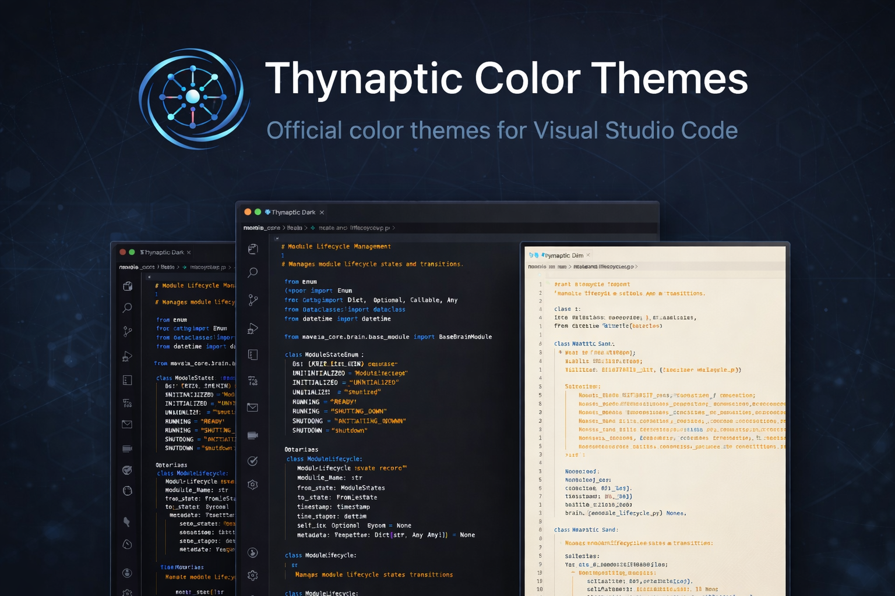
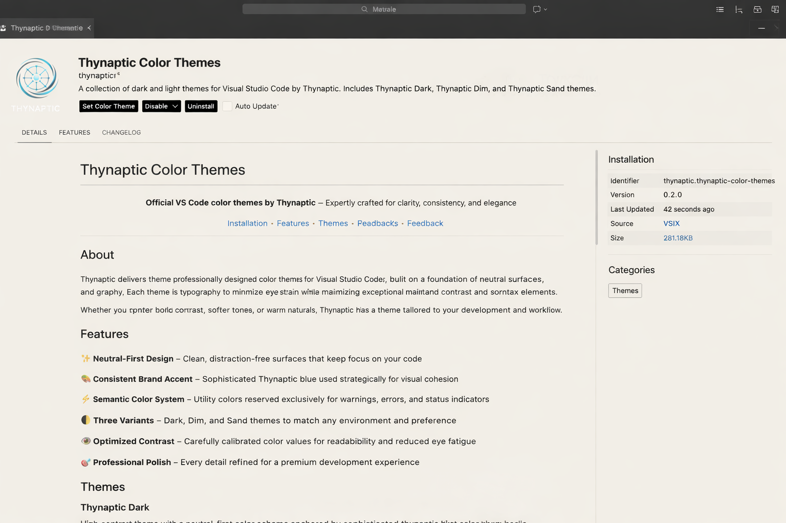
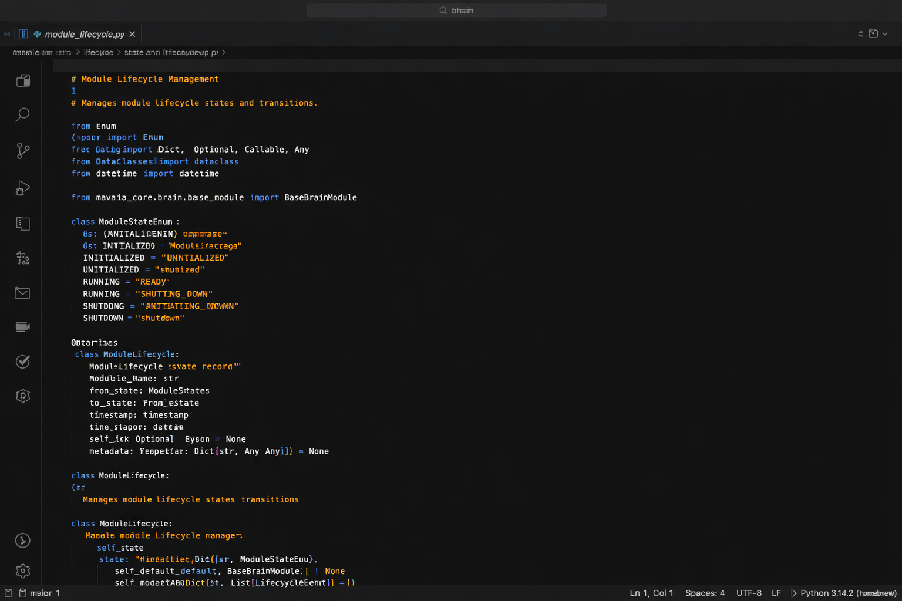
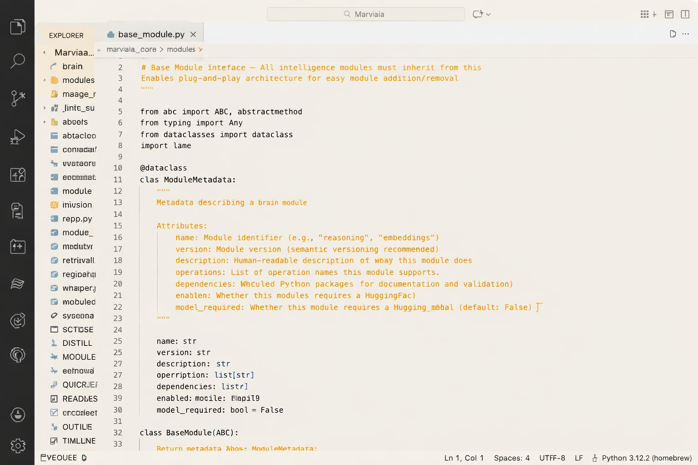

# Thynaptic Color Themes

**Official VS Code color themes by Thynaptic** – Expertly crafted for clarity, consistency, and elegance

---

## Overview

Three professionally designed themes built on neutral surfaces and refined typography. Each theme minimizes eye strain while maintaining exceptional contrast and readability across all syntax elements.

- **Thynaptic Dark** – High contrast for well-lit environments
- **Thynaptic Dim** – Softer contrast for low-light and extended sessions  
- **Thynaptic Sand** – Warm light theme with natural aesthetics

## Features

✨ Neutral-First Design – Clean, distraction-free surfaces  
🎨 Consistent Thynaptic Blue – Strategic visual cohesion  
⚡ Semantic Colors – Warnings, errors, and indicators  
👁️ Optimized Contrast – Reduced eye fatigue  

## Screenshots

  

## Installation

1. Open **Visual Studio Code**
2. Go to Extensions (Ctrl+Shift+X / Cmd+Shift+X)
3. Search **"Thynaptic Color Themes"**
4. Click **Install**
5. Open Command Palette (Ctrl+Shift+P / Cmd+Shift+P)
6. Select **Preferences: Color Theme** and choose your theme

## License

MIT – See [LICENSE](LICENSE)
